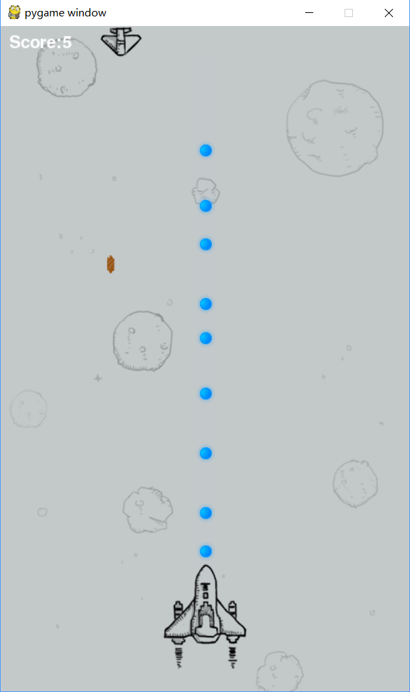

# python_study
学习python过程中，练手的一些小东西.
1. [fly](https://github.com/shazhongcheng/python_study/tree/master/venv/code/fly)是一个飞机大战的一个小游戏

2.[my_web](https://github.com/shazhongcheng/python_study/tree/master/venv/code/my_web)是自己模拟的Diango框架的实现.
